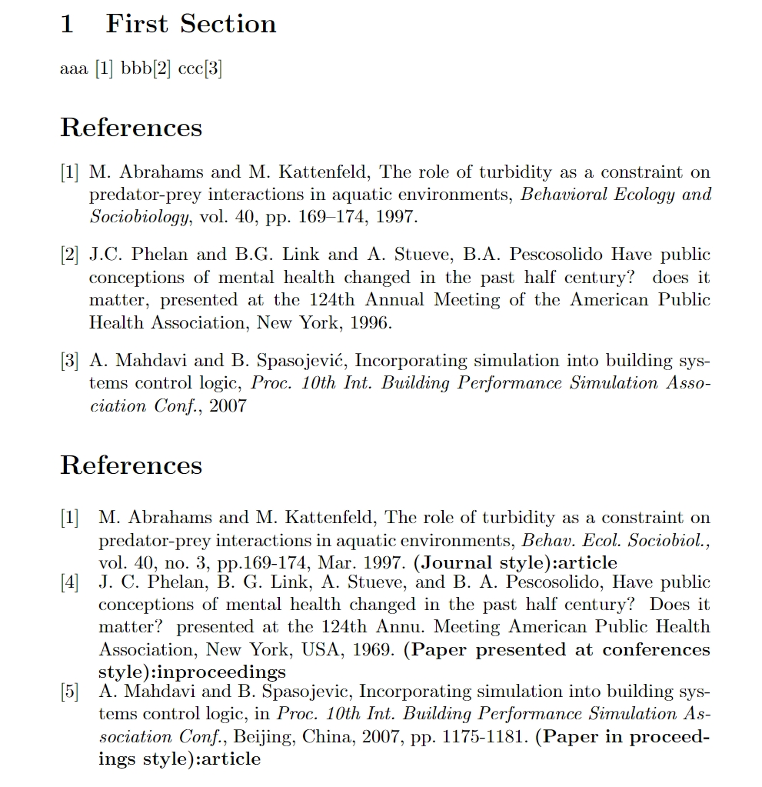

# bibitem generation for Big Data Mining and Analytics (BDMA)

 

# 1. How to use

BDMA has typical ref style which have a big difference with other journal (ieee, elsiver, etc), so I made a simple script to gerneate bbl to create bibitem.

Here is the step:

* Paste your `\document{...}` code into [bdma.tex](bdma.tex), compile it with tex and bibtex. (xelatex->biblatex->xelatex->xelatex)
* Run [format.py](format.py) to fix the author format of bbl file.
* Compile tex file without bibtex (xelatex), copy `\bibitem` in bbl into your tex and recompile it.

# 2. Note 

*Note* : NOT READY TO GO. There are some points the repo CAN'T do.

* Journal name abbrevation: The instruction abbr the `Behavioral Ecology and Sociobiology` into `Behav. Ecol. Sociobiol.` . However, even the [journal itself](https://link.springer.com/journal/265) HAVE NOT use this abbr. And many article in BDMA not using this abbr, so ignored.
* Title name connection when ended with symbol: If title ended with a symbol like `"..., does it matter ?"`, the bbl file will use `?` to overwrite `,`.

# 3. Detail

[ieeetr-revised.bst](ieeetr-revised.bst):
* Italic for journal name
* Remove `"` for journal name

[format.py](format.py), change author style into:

* If an author have many surname, abbrevate into one: `Abrahams, Mark V` in bbl is `M. Abrahams`.
* If an author's surname is multi-uppercase, split it: `Phelan, JC` in bbl is `J.C. Phelan`

Also could be used for ieee article in [ieee.tex](ieee.tex)
